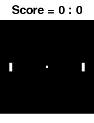
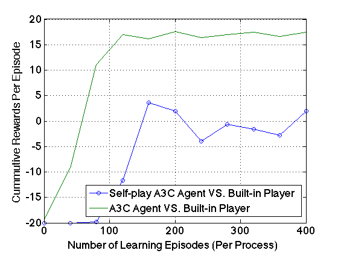

# Self-play Learning for Pong Game

## Introduction

- A newly developed (with pygame) [**PongGame**](https://github.com/xinghai-sun/deep-rl/blob/master/envs/pong_env.py) gym environment, supporting both **single player** mode (battle with the built-in player) and **double player** mode (battle with itself, or any other external player). Notice that the original Pong-v2 env in the open-ai gym does not support double player mode.
- An [**A3C** Agent](https://github.com/xinghai-sun/deep-rl/blob/master/agents/a3c.py) implemented with PyTorch. Other RL algorithms (e.g. DQN) are also provided in [here](https://github.com/xinghai-sun/deep-rl/tree/master/agents).
- **Self-play** learning settings: for each episode, we first randomly select an opponent player from the recent copies of the learning agent itself. Then let the learning agent play against this opponent, learn from the experiences, and become stronger. Since such an opponent (a random history version of itself) can also become stronger than before, it forces the learning agent to grow up to be even stronger.


## Experiments

We mainly compare three players:

- **Built-in**: a rule-based built-in player.
- **A3C-basic**: a A3C agent player learning from combating against the Built-in player. It only experiences $360 \times 16$ episodes with 16 asynchronous processes, due to the limited time available.
- **A3C-selfplay**: a A3C agent learning from combating against itself (one of its history versions). It only experiences $360 \times 16$ episodes with 16 asynchronous processes, due to the limited time available.

Figure 1, 2, 3 show us the real playing video with the above players, battling with one another.

<div align="center">
</br>
Fig 1. A3C-basic vs. Built-in
</div>

<div align="center">
</br>
Fig 2. A3C-selfplay vs. Built-in
</div>


<div align="center">
</br>
Fig 3. A3C-selfplay vs. A3C-basic
</div>

### Learning Speed

<div align="center">
</br>
Fig 4. Learning curves of A3C-selfplay agent (play against itself) and A3C-basic agent (play against the built-in rule-based player). The figure plots the average (over 10 random games) cumulative rewards of  evaluative battle results combating with the built-in player as the opponent.
</div>

### Scoreboard

Player VS. Player | Average Score (20 games)
:-----------: | :------------:
A3C-Basic VS. Built-in  | 18.5 : 1.5
A3C-Selfplay VS. Built-in  | 9.6 : 10.4
A3C-Selfplay VS. A3C-Basic | 14.5 : 5.5

Notice that even the A3C-selfplay agent did not play as perfectly as the A3C-basic agent when combating with the built-in player. However, when combating with each other, A3C-selfplay outperforms A3C-basic, overwhelmingly and interestingly.


## Quick Start

### Preliminaries

1. Install pytorch 0.1.10.post2
2. Install dependencies:

```
pip install -r requirements.txt
```

### Run A3C-basic

```
python run_async.py --config conf/a3c_my-pong.yaml
```

### Run A3C-selfplay

```
python run_selfplay.py --config conf/a3c_my-selfplay_my-pong.yaml
```

### Run Evaluation
```
python eval.py --mode combat --config conf/a3c_selfplay_my-pong.yaml --eval_model_path checkpoints/agent.model-360 --eval_opponent_path checkpoints/agent.model-100
```
